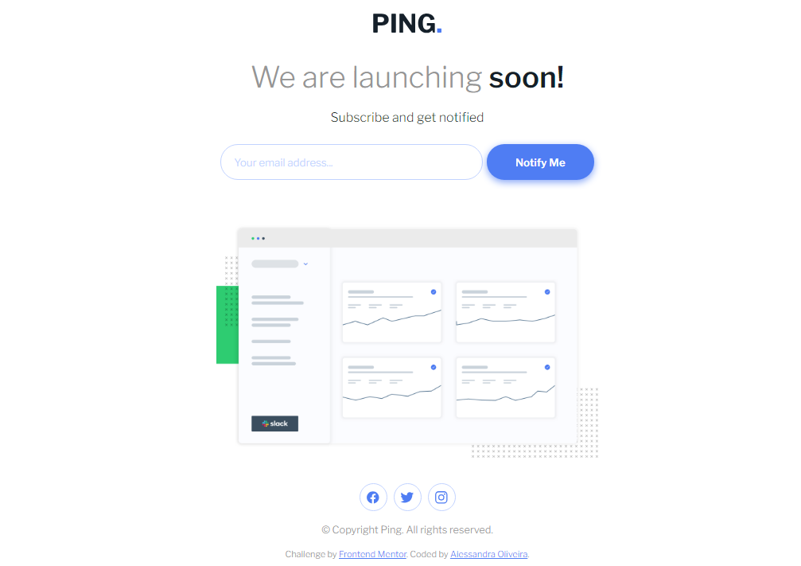
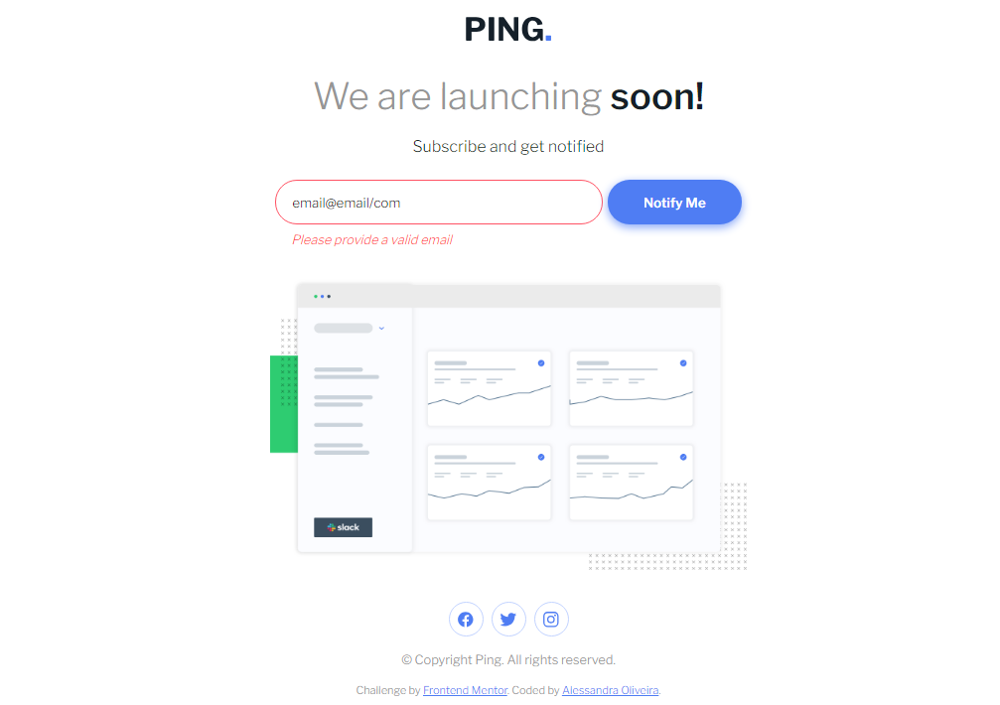

# Frontend Mentor - Ping coming soon page solution

This is a solution to the [Ping coming soon page challenge on Frontend Mentor](https://www.frontendmentor.io/challenges/ping-single-column-coming-soon-page-5cadd051fec04111f7b848da).

## Table of contents

- [Overview](#overview)
  - [The challenge](#the-challenge)
  - [Screenshot](#screenshot)
  - [Links](#links)
- [My process](#my-process)
  - [Built with](#built-with)
- [Author](#author)

## Overview

This is a solution to the ping coming soon page challenge on frontend mentor. It was built entirely with HTML, CSS and JavaScript.

### The challenge

Users should be able to:

- View the optimal layout for the site depending on their device's screen size
- See hover states for all interactive elements on the page
- Receive an error message when the `form` is submitted if:
	- The `input` field is empty. The message for this error should say *"Whoops! It looks like you forgot to add your email"*
	- The email address is not formatted correctly (i.e. a correct email address should have this structure: `name@host.tld`). The message for this error should say *"Please provide a valid email address"*

### Screenshot

**Desktop solution:**

  

**Mobile solution:**

  

**Error state solution:**

  

### Links

- Solution URL: [Solution on Frontend Mentor](https://your-solution-url.com)
- Live Site URL: [Live solution with Github Pages](https://your-live-site-url.com)

## My process

### Built with

- Semantic HTML5 markup
- CSS custom properties
- Flexbox
- CSS Grid
- JavaScript
  
## Author

- LinkedIn - [Alessandra Oliveira](https://www.linkedin.com/in/alessandra-santos-oliveira/)
- Frontend Mentor - [@itsale-o](https://www.frontendmentor.io/profile/itsale-o)
- Twitter - [@itsale_o](https://www.twitter.com/itsale_o)
